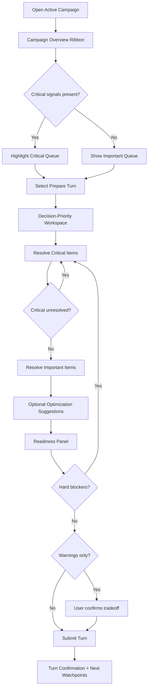
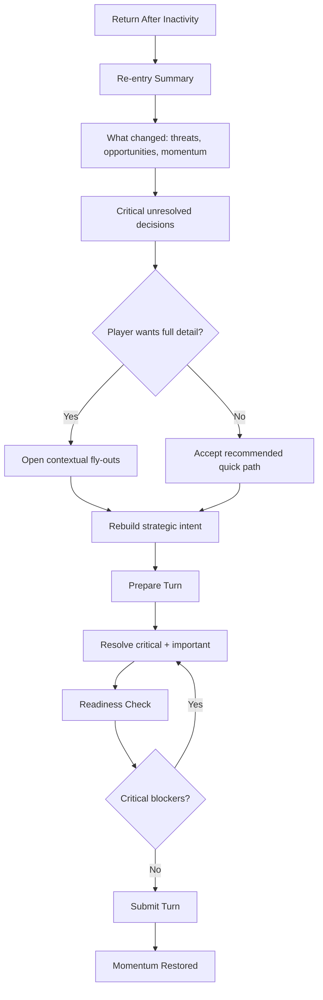
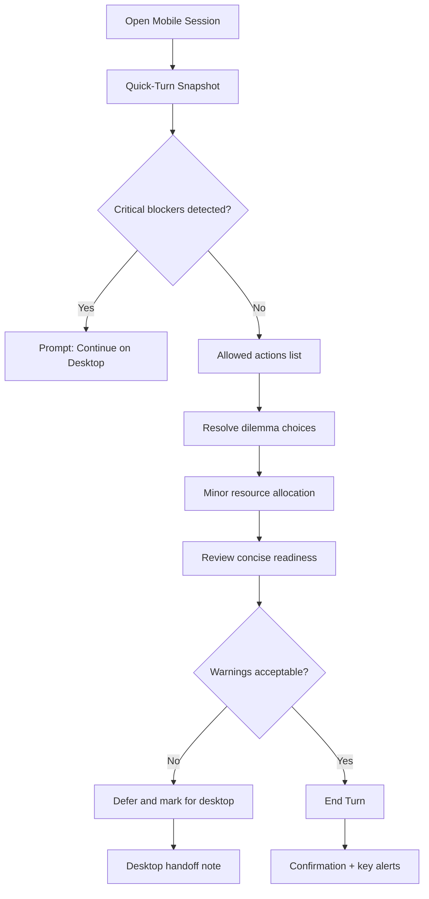

# UX Design Specification space

**Author:** Rouby
**Date:** 2026-03-08

---

<!-- UX design content will be appended sequentially through collaborative workflow steps -->

## Executive Summary

### Project Vision

`space` is an async-first browser 4X designed for experienced strategy players who want long-form, socially sustained campaigns without late-game collapse. The UX vision is to preserve strategic depth while reducing operational burden through high-signal decision flows, clear state interpretation, and a dilemma system that keeps uncertainty and agency alive through the full campaign arc.

The product is desktop-first for deep strategic interaction, with mobile positioned as a fast continuity surface for lightweight turns and simple decisions.

### Target Users

Primary users are veteran 4X players coordinating campaigns with friend groups over weeks or months. They are strategy-literate, tolerant of depth, and motivated by meaningful long-horizon planning, but they disengage when turn work becomes administratively heavy or outcomes feel inevitable.

Usage context is split by intent:
- Desktop: primary surface for high-complexity planning and full-system decision making.
- Mobile: secondary surface for quick, low-complexity turn completion (selected decisions + end turn).

### Key Design Challenges

1. Turn Submission Complexity
Transforming large strategic state into a manageable, confidence-building turn submission flow without oversimplifying core systems.

2. Strategic Information Density
Presenting broad campaign and empire context so players can identify what matters now versus what can wait.

3. Cross-Device Intent Separation
Supporting deep desktop play and lightweight mobile continuity without creating inconsistent rules, hidden state, or trust gaps.

4. Fairness and Agency Perception
Helping players understand why outcomes happen so strategic losses feel earned rather than opaque or predetermined.

### Design Opportunities

1. Decision-Priority Turn Workflow
A desktop turn pipeline that surfaces unresolved critical decisions first, then guides optional optimizations by impact.

2. Campaign Overview as Strategic Command Surface
A high-signal campaign overview that summarizes threats, opportunities, momentum shifts, and unresolved priorities before turn commitment.

3. Mobile Quick-Turn Mode
A constrained mobile mode optimized for fast continuity actions, with clear escalation prompts when deep systems require desktop review.

4. Explainable Consequence UX
Outcome previews and post-resolution explainability patterns that strengthen trust in dilemmas, combat results, and campaign-state changes.

## Core User Experience

### Defining Experience

The core experience of `space` is a confidence-first turn submission loop that lets experienced players convert complex strategic state into decisive action without unnecessary friction. The primary interaction is not just submitting a turn, but submitting it with informed confidence.

The turn flow should support three layers:
1. Complete required decisions and resolve blockers.
2. Confirm strategic safety and readiness to end turn.
3. Optionally review high-impact optimization suggestions before commit.

If this loop is clear, trustworthy, and efficient, the rest of the UX can scale around it.

### Platform Strategy

`space` is desktop-first for deep strategic play, where users need broad visibility, comparison, and sequencing support across multiple systems.

Mobile is a continuity surface, not a full command surface. It is optimized for lightweight turn progression, allowing quick completion actions without forcing deep-system management on small screens.

Desktop and mobile must share the same game truth and decision integrity, while intentionally differing in interaction depth.

### Effortless Interactions

The following interactions should feel natural and low-friction:

- Turn Submission Pipeline:
A guided path from unresolved decisions to turn commit, with clear state, blocker visibility, and confidence feedback.

- Strategic Readiness Check:
A lightweight but high-trust confirmation layer that tells players whether they are safe to end turn and highlights critical omissions.

- Campaign Overview Scan:
A fast-read command surface showing threats, opportunities, unresolved decisions, momentum trends, and rival intent signals before players dive into detailed systems.

- Mobile Quick-Turn Flow:
Resolve dilemmas, review essential updates, perform minor resource allocations, and end turn in a short focused session.

### Critical Success Moments

1. Campaign-Level Clarity Moment (Primary)
The user quickly understands a meaningful strategic shift at the campaign level via overview signals and can act with intent.

2. Turn Confidence Moment
The user reaches end-turn with confidence because blockers are resolved and readiness cues are explicit.

3. Fast Continuity Moment (Mobile)
The user completes a lightweight turn from mobile without feeling under-informed or forced into deep management contexts.

4. Failure-Sensitive Moment
If turn submission loses clarity, trust, or consequence transparency, perceived product quality drops sharply. This is a make-or-break interaction.

### Experience Principles

1. Confidence Before Commitment
Never ask for end-turn commitment without clear readiness and consequence awareness.

2. Prioritize by Strategic Impact
Surface what matters now, defer lower-impact optimization, and preserve player agency over optional depth.

3. Desktop for Depth, Mobile for Continuity
Design each platform for its strongest use mode while maintaining consistent game-state trust.

4. Campaign Context First
Lead with high-signal overview intelligence so each turn starts from strategic understanding, not raw data parsing.

5. Explainability Builds Fairness
Make outcomes and recommendations legible so players perceive losses and wins as earned.

## Desired Emotional Response

### Primary Emotional Goals

The primary emotional goal for `space` is strategic confidence under complexity. Users should feel that they can understand a shifting campaign state, make high-quality decisions, and commit turns with clarity rather than doubt.

A secondary core goal is sustained strategic tension: players should feel that outcomes remain contestable, meaningful, and worth investing in over long campaign horizons.

### Emotional Journey Mapping

- Discovery / Return:
Users should feel intrigued and quickly oriented, with a clear sense of what changed and why it matters.

- Campaign Overview:
Users should feel informed and situationally aware, not overloaded. The overview should create "I see the battlefield" confidence.

- Turn Construction:
Users should feel focused and in control as they resolve required actions and choose optional optimizations.

- Turn Commitment:
Users should feel assured and accountable, with confidence that they are ending turn intentionally, not blindly.

- Post-Outcome / Next Re-entry:
Users should feel outcomes are legible and fair, even when unfavorable, and motivated to re-engage.

### Micro-Emotions

Critical micro-emotions to cultivate:
- Confidence over confusion during turn planning.
- Trust over skepticism in system outcomes and recommendations.
- Productive tension over anxiety in campaign uncertainty.
- Accomplishment over fatigue after turn completion.
- Momentum over drift when returning after time away.

Critical micro-emotions to avoid:
- Opaque uncertainty ("I don't know why this happened").
- Administrative exhaustion ("I'm doing chores, not strategy").
- Forced urgency on mobile for decisions that require deep context.
- Fatalism ("the campaign is already decided").

### Design Implications

- Confidence:
Use decision-priority structures, explicit blockers, and readiness checks before turn commit.

- Trust:
Provide clear consequence previews and outcome explainability for dilemmas, combat, and major state shifts.

- Productive Tension:
Show strategic risk/opportunity signals in overview without overwhelming raw data volume.

- Accomplishment:
Frame end-turn as completion of a meaningful strategic cycle with clear "you handled what matters" feedback.

- Continuity:
Design mobile quick-turn for low-complexity progress and route deep/system-heavy actions back to desktop.

### Emotional Design Principles

1. Clarity Creates Confidence
Every major turn decision should be understandable in context before commitment.

2. Explainability Preserves Fairness
Users should always be able to understand what changed and why.

3. Tension Without Chaos
The game should feel uncertain and alive, but never incomprehensible.

4. Commitment Should Feel Intentional
Ending a turn should signal strategic ownership, not mechanical completion.

5. Return Should Restore Momentum
Re-entry experiences should rebuild context quickly and re-enable agency.

## UX Pattern Analysis & Inspiration

### Inspiring Products Analysis

**Stellaris**
Stellaris demonstrates strong early-game engagement through clear expansion incentives, rapid discovery feedback, and a compelling "just one more decision" rhythm. It succeeds at making the opening phase feel alive and strategically expressive.
However, it is a cautionary reference for late-game UX and balance pressure: complexity and outcome predictability can increase as campaigns mature, reducing perceived agency and sustained engagement.

**Civilization**
Civilization is a strong all-around benchmark for turn-based strategic readability and broad usability. It maintains a generally coherent decision cadence and approachable strategic framing across long play sessions.
Its gap for this project context is diplomatic depth; this highlights an opportunity for `space` to create richer strategic tension through stronger diplomacy-linked and dilemma-linked consequence systems.

### Transferable UX Patterns

- Detail-Drilldown via Fly-outs:
Use layered fly-outs/panels to keep strategic context visible while allowing deep inspection of systems (economy, fleets, dilemmas, rivals) without hard context switches.

- High-Signal Turn Rhythm:
Borrow early-game engagement pacing patterns by surfacing clear next-actions and immediate strategic feedback loops.

- Strategic Readability First:
Adopt Civilization-style "understandable at a glance, deep on demand" information hierarchy for campaign overview and turn readiness.

### Anti-Patterns to Avoid

- Overloaded Screens with Low-Actionability:
Avoid presenting large volumes of data that do not directly support a decision in the current turn context.

- Late-Game Information Sprawl:
Avoid UI structures where depth accumulates as unmanaged clutter, forcing users into cognitive triage.

- Context Loss During Deep Inspection:
Avoid drill-in patterns that hide global campaign state and force users to mentally reconstruct strategic context.

### Design Inspiration Strategy

**What to Adopt**
- Fly-out based detail drilldown to support depth without losing top-level strategic orientation.
- Early-game-style action momentum patterns to keep each turn feeling meaningful and focused.
- Readable strategic overview conventions that prioritize actionable intelligence.

**What to Adapt**
- Adapt Stellaris-like depth into a decision-priority model that remains manageable in mid/late campaign.
- Adapt Civilization-like broad clarity with stronger diplomacy and dilemma consequence visibility tailored to async long-form campaigns.

**What to Avoid**
- Any screen composition that increases information density without increasing decision quality.
- Any late-campaign UX pattern that obscures agency or makes outcomes feel predetermined through presentation fatigue.

## Design System Foundation

### 1.1 Design System Choice

`space` will use a **themeable design system approach**, keeping **Mantine** as the core component foundation and building a custom game-specific design layer on top.

This provides proven accessibility and delivery speed while enabling a distinct strategic game identity through controlled customization.

### Rationale for Selection

1. Balance of Speed and Uniqueness
Mantine gives fast implementation for foundational UI primitives while allowing strong visual differentiation through theming and component variants.

2. Technical Alignment with Existing Stack
The current frontend already uses Mantine, so retaining it avoids migration risk and preserves implementation momentum.

3. Desktop-First Strategy Needs
The product requires dense, high-signal strategic interfaces. A themeable system with extensible components supports this better than rigid presets or full from-scratch overhead.

4. Long-Term Differentiation Intent
The team is willing to invest significantly in uniqueness, which justifies building a layered custom system above Mantine rather than stopping at default styles.

### Implementation Approach

1. Keep Mantine as Base Layer
Use Mantine for foundational primitives: layout, typography scaffolding, overlays/drawers/fly-outs, forms, feedback states, and accessibility baselines.

2. Introduce a Design Token Layer
Define product-specific tokens for:
- Color semantics (threat, opportunity, unresolved, confidence, neutral context)
- Typography hierarchy for strategic scanning
- Spacing/density scales for desktop deep-play and mobile quick-turn modes
- Interaction states (focus, urgency, confirmability, disabled confidence)

3. Build Gameplay-Specific Component Layer
Implement reusable domain components over base primitives:
- Campaign overview cards and strategic signal rows
- Decision-priority panels
- Turn readiness and confidence indicators
- Fly-out drilldown shells and comparative detail panes

4. Enforce Pattern Consistency
Codify component usage rules and information hierarchy patterns to prevent drift into generic screens or overloaded low-actionability views.

### Customization Strategy

- Moderate-to-High Visual Customization:
Use custom tokens and semantic variants across core surfaces so the UI feels unmistakably `space`, not stock Mantine.

- Targeted Deep Custom Components:
Invest heavily in high-impact gameplay interactions (turn submission, campaign overview, fly-out drilldowns) while reusing base primitives for commodity interactions.

- Progressive Differentiation:
Phase custom depth by impact:
1. Core turn and overview surfaces first
2. Secondary management surfaces next
3. Peripheral/admin surfaces last

- Governance for Uniqueness at Scale:
Maintain a documented variant system and component decision matrix so future features preserve strategic readability, emotional goals, and brand consistency.

## 2. Core User Experience

### 2.1 Defining Experience

The defining experience of `space` is:

**"I can turn overwhelming empire complexity into a clear prioritized plan and a confidently committed turn."**

This is delivered through a campaign-overview-first flow that frames strategic reality before decision execution. The core value is not just action throughput, but strategic clarity and confidence under complexity.

### 2.2 User Mental Model

Target users approach `space` with a 4X veteran mental model:
- They expect broad strategic agency and long-horizon consequences.
- They are comfortable with depth, but not with avoidable cognitive clutter.
- They think in priorities, risk tradeoffs, and timing windows, not in isolated UI tasks.

Current-solution expectations and pain points:
- Users expect campaign overview context before committing actions.
- They become frustrated when information is dense but not actionable.
- They dislike late-game patterns where state is hard to parse and outcomes feel predetermined.
- They value systems that reward planning quality and make consequences legible.

### 2.3 Success Criteria

The core interaction is successful when:

1. Strategic Prioritization Clarity
Users can identify what matters this turn within one overview pass.

2. Confident Commitment
Users end turn with explicit confidence that critical issues are resolved.

3. Actionable Density
Information presented during turn prep is directly tied to decisions, with minimal low-value noise.

4. Fast Orientation on Return
Returning users regain campaign context quickly and can re-enter meaningful decision-making without overload.

5. Trustworthy Consequence Model
Users can understand why recommendations, outcomes, and state changes occur.

### 2.4 Novel UX Patterns

`space` combines established and novel patterns:

- Established patterns:
  - Campaign summary/dashboard framing
  - Progressive drilldown via fly-outs
  - Guided checklist-like completion logic before submission

- Novel synthesis:
  - A strategy-grade "decision-priority engine" that dynamically ranks unresolved actions by campaign impact.
  - Confidence-centered turn commitment that pairs readiness state with consequence-aware prompts.
  - Hybrid gating tuned for strategic gameplay: hard blocks on critical unresolved items, warnings for optional optimizations.

This is not a brand-new interaction metaphor, but a distinctive composition of familiar patterns optimized for async 4X depth.

### 2.5 Experience Mechanics

1. Initiation
- Desktop flow starts on campaign overview.
- User selects "Prepare Turn" after reviewing threats, opportunities, momentum, and rival intent signals.

2. Interaction
- System presents prioritized decision queues (critical, important, optional).
- User resolves items through contextual fly-outs without losing campaign-level orientation.
- Optional optimization suggestions appear after critical path completion.

3. Feedback
- Real-time readiness indicator communicates current submission status.
- Critical unresolved items are explicitly highlighted.
- Impact previews and explanation snippets provide confidence in consequence pathways.

4. Completion
- Hybrid gate enforces completion of critical unresolved items.
- Optional items remain skippable with explicit warning context.
- User submits turn with a confirmation state that reinforces strategic ownership and next-step awareness.

## Visual Design Foundation

### Color System

No existing brand guideline constraints are currently defined, so the color system is intentionally created to support a **tactical/utilitarian** tone aligned with strategic clarity and decision confidence.

Color strategy:
- Prioritize semantic utility over decorative saturation.
- Use restrained, high-contrast neutrals for base surfaces.
- Reserve accent colors for strategic meaning (not ornament).
- Keep emotional signaling functional: urgency, opportunity, unresolved state, and confidence cues should be instantly scannable.

Semantic mapping (initial):
- Primary: command/action intent (confirmative but not overly bright)
- Secondary: contextual navigation and supporting controls
- Success: validated readiness / completed critical decisions
- Warning: unresolved important items / non-blocking risk
- Error/Critical: blocking issues requiring action before turn submission
- Info/Signal: momentum shifts, rival intent indicators, strategic updates
- Neutral tiers: layered backgrounds, panels, separators, and low-emphasis metadata

Accessibility baseline:
- Ensure WCAG-appropriate contrast for all semantic states, especially warning/error on dense strategic surfaces.
- Avoid color-only meaning; pair key statuses with iconography/text labels.
- Maintain clear focus indicators across keyboard navigation paths.

### Typography System

Typography direction: **sans-serif UI foundation + serif/accent strategic flavor**.

System structure:
- Primary UI typeface (sans): used for operational interaction, labels, forms, controls, and compact data display.
- Secondary accent typeface (serif): used selectively for high-level strategic headers, campaign state framing, and thematic emphasis.
- Preserve readability-first behavior for all tactical decision areas; serif usage should never reduce scan speed for dense information zones.

Hierarchy strategy:
- Distinct heading scale for campaign overview and section-level strategic context.
- Compact but legible body and metadata styles suitable for medium-dense dashboards.
- Strong contrast between actionable text, contextual text, and low-priority metadata.

Readability/accessibility:
- Line-height and weight pairings tuned for prolonged desktop sessions.
- Font sizing and contrast support quick scanning and low cognitive strain.

### Spacing & Layout Foundation

Layout density target: **medium-dense** desktop command-surface model.

Spacing system:
- Base unit: **8px**.
- Use 8px increments for macro rhythm (section spacing, panel separation) and half-steps only when needed for compact controls.
- Maintain consistent vertical cadence to support predictable scanning through overview -> priorities -> drilldowns.

Layout principles:
1. Overview First
Initial viewport should present high-signal campaign context before deep controls.

2. Actionability Over Volume
Screen real estate is allocated by decision relevance, not by data availability.

3. Persistent Orientation
Drilldown fly-outs should preserve campaign context and avoid full-page context loss.

Grid/foundation:
- Desktop-first multi-column structure supporting overview panels + prioritized action queues.
- Mobile retains constrained quick-turn pathways, with deep-system tasks deferred to desktop.

### Accessibility Considerations

- Contrast: enforce robust contrast across all semantic states, including tactical warning/error combinations.
- Keyboard support: ensure full operability of turn-prep workflow, fly-outs, and readiness/submit controls.
- Focus clarity: high-visibility focus states for dense interfaces with many interactive elements.
- Cognitive accessibility: reduce un-actionable information, preserve clear status labels, and sequence decisions by importance.
- Responsive intent integrity: mobile quick-turn mode must remain comprehensible without exposing users to deep-management overload.

## Design Direction Decision

### Design Directions Explored

We explored 8 direction variations in an interactive HTML showcase, each applying the established foundation (tactical/utilitarian tone, medium-dense desktop layout, fly-out drilldowns, confidence-first submission model):

1. Command Deck - overview-first command surface
2. Tactical Grid - high-density power-user dashboard
3. Narrative Ops - immersive strategic framing
4. Split Command - desktop depth with mobile quick-turn pairing
5. Signal Wall - telemetry-dense signal matrix
6. Clear Chain - linear priority-to-submission flow
7. Pocket Ops - mobile continuity companion
8. War Room - balanced layered command environment

### Chosen Direction

**Primary Direction: Direction 8 (War Room)**
**Combined Elements:**
- Direction 6 decision chain for submission flow clarity
- Direction 4 cross-device split behavior for mobile quick-turn continuity
- Direction 8 layered command architecture as the visual/structural base

### Design Rationale

This combination best supports the core product promise:
- Preserves campaign overview context while enabling deep tactical drilldown.
- Reduces cognitive overhead by sequencing decisions by strategic impact.
- Reinforces confidence before turn commitment with explicit readiness and explainability.
- Maintains a coherent desktop-first command experience while keeping mobile useful for lightweight progression.

It also aligns with the anti-pattern constraint: avoid high-volume, low-actionability information surfaces.

### Implementation Approach

1. Base layout from War Room:
- Overview ribbon
- Two-column action surface
- Persistent signal rail
- Context-preserving fly-outs

2. Submission flow from Clear Chain:
- Campaign pulse -> critical blockers -> high-impact actions -> optional optimizations -> submit

3. Device behavior from Split Command:
- Desktop for full planning depth
- Mobile quick-turn for constrained actions (dilemmas, minor allocations, end turn)

4. Progressive rollout:
- Phase 1: overview + readiness + critical queue
- Phase 2: explainability layer + optional optimization suggestions
- Phase 3: advanced comparative fly-outs and richer signal modeling

## User Journey Flows

### Journey 1: Campaign Overview to Confident Turn Submission (Primary)

This is the defining daily loop for desktop-first play: orient quickly, resolve what matters, and submit with confidence.

### Journey 2: Missed-Turn Re-entry Recovery

This flow restores momentum without overload after inactivity.

### Journey 3: Mobile Quick-Turn Continuity

This flow supports low-complexity progression while preserving trust and escalation to desktop when needed.

### Journey Patterns

- Overview-first orientation before deep interaction.
- Decision-priority sequencing (`critical -> important -> optional`).
- Context-preserving drilldowns via fly-outs instead of hard page transitions.
- Hybrid gating: hard block on critical unresolved, warnings for optional tradeoffs.
- Explicit readiness and consequence visibility before commitment.
- Device-intent split: desktop depth, mobile continuity.

### Flow Optimization Principles

- Minimize steps to strategic confidence, not just to click completion.
- Prefer actionable signals over full-state dumps.
- Keep campaign context visible while inspecting details.
- Make failure paths recoverable with clear next actions.
- Reinforce accomplishment at submission with "what you handled" and "what to watch next."
- Escalate deep/ambiguous actions to desktop early to avoid mobile cognitive overload.

## Component Strategy

### Design System Components

Using Mantine as the base layer, `space` can rely on design-system components for foundational UI primitives:

- Layout and structure: AppShell-like scaffolding, Grid, Stack, Group, Container, Paper/Card surfaces
- Inputs and controls: Button, ActionIcon, Select, SegmentedControl, Switch, Tabs, Tooltip
- Overlays and drilldown shells: Drawer/Modal/Popover for fly-out detail patterns
- Feedback and status: Badge, Alert, Progress, Skeleton, Notifications
- Navigation and utility: Breadcrumb, Menu, pagination/list utilities

These components cover structural consistency, baseline accessibility, and rapid implementation for non-domain-specific interactions.

**Coverage gaps relative to core journeys:**
- No native strategy-grade decision-priority queue model
- No campaign-specific overview signal composition
- No domain-ready readiness/confidence gate component
- No native strategic explainability panel for outcomes/recommendations

### Custom Components

### CampaignOverviewRibbon

**Purpose:** Present top-level strategic state in one scan before turn preparation.
**Usage:** Always at top of desktop campaign surface; compact variant in mobile snapshot.
**Anatomy:** Momentum strip, threat/opportunity indicators, rival-intent signal, unresolved summary.
**States:** loading, normal, elevated-risk, critical-alert, stale-data warning.
**Variants:** desktop full, mobile compact, high-alert emphasis.
**Accessibility:** Landmark region, status labels not color-only, keyboard focusable drill-in targets.
**Content Guidelines:** Show only actionable deltas and high-impact changes.
**Interaction Behavior:** Clicking signals opens contextual fly-out without losing overview context.

### DecisionPriorityQueue

**Purpose:** Sequence decisions by strategic impact (`critical -> important -> optional`).
**Usage:** Primary workspace after "Prepare Turn."
**Anatomy:** Sectioned queue, item cards, impact tags, effort estimate, dependency markers.
**States:** unresolved, in-progress, resolved, blocked, deferred.
**Variants:** dense desktop, compact mobile continuity list (limited actions).
**Accessibility:** Ordered list semantics, keyboard reorder/advance support where relevant, clear status announcements.
**Content Guidelines:** Each item must expose "why it matters now."
**Interaction Behavior:** Selecting item opens detail fly-out; completion auto-advances to next highest priority.

### TurnReadinessPanel

**Purpose:** Provide confidence-first submission state and gating status.
**Usage:** Persistent in turn-prep context; final checkpoint before submit.
**Anatomy:** readiness score, blocker list, warning list, consequence highlights, submit control.
**States:** blocked, caution, ready, submitting, submitted.
**Variants:** sticky desktop side panel, condensed mobile confirmation block.
**Accessibility:** Live region updates for blocker changes; explicit text for all statuses.
**Content Guidelines:** Separate hard blockers from skippable warnings clearly.
**Interaction Behavior:** Hard blocks prevent submit; warnings allow proceed with explicit acknowledgment.

### StrategicDrilldownFlyout

**Purpose:** Inspect detail without context loss.
**Usage:** Opened from overview signals and queue items.
**Anatomy:** header (context + risk), evidence section, actions section, impact preview.
**States:** loading, normal, conflict warning, error recovery.
**Variants:** side fly-out (desktop), full-screen sheet (mobile where allowed).
**Accessibility:** Focus trap, escape behavior, return-focus to trigger, keyboard-operable controls.
**Content Guidelines:** Lead with implications, then supporting data.
**Interaction Behavior:** Save/resolve actions update parent queue and readiness panel in real time.

### OutcomeExplainabilityPanel

**Purpose:** Build trust in recommendations and outcomes.
**Usage:** Attached to dilemmas/combat/result-sensitive flows.
**Anatomy:** "What changed," "Why," "What to watch next."
**States:** pre-resolution preview, post-resolution summary, uncertainty flagged.
**Variants:** inline summary + expandable detail.
**Accessibility:** Structured headings and plain-language summaries.
**Content Guidelines:** Avoid opaque scoring without explanation cues.
**Interaction Behavior:** Link directly to impacted systems/actions.

### Component Implementation Strategy

- Build all custom components on Mantine primitives and tokenized variants.
- Use semantic tokens for threat/opportunity/readiness rather than ad hoc colors.
- Standardize interaction contracts across components:
  - `onResolve`, `onDefer`, `onEscalateToDesktop`, `onInspectDetails`
- Keep data contracts strict and concise to avoid low-actionability payloads.
- Enforce accessibility at component API level (required labels/status props).
- Document "when not to use" for each component to prevent misuse and clutter.

### Implementation Roadmap

**Phase 1 - Core Turn Loop Components**
- CampaignOverviewRibbon
- DecisionPriorityQueue
- TurnReadinessPanel

**Phase 2 - Context and Trust Enhancements**
- StrategicDrilldownFlyout
- OutcomeExplainabilityPanel

**Phase 3 - Efficiency and Adaptation**
- Comparative signal widgets for advanced desktop planning
- Mobile continuity wrappers and handoff affordances
- Pattern hardening for admin/support-adjacent surfaces

## UX Consistency Patterns

### Button Hierarchy

**Primary Action**
- Usage: one primary action per view context (for example `Prepare Turn`, `Submit Turn`).
- Visual design: highest emphasis, command-intent color, strong contrast.
- Behavior: disabled only when blocked by hard prerequisites; include explicit reason text.
- Accessibility: clear button label + state announcements for disabled/loading/submitting.

**Secondary Action**
- Usage: supporting actions that advance context without committing (for example `Review Signals`, `Open Fly-out`).
- Visual design: medium emphasis, outlined/tonal variant.
- Behavior: never visually compete with primary call-to-action.

**Tertiary / Utility Action**
- Usage: low-risk helpers (`Defer`, `Dismiss`, `View Details`).
- Visual design: subtle text/icon treatment.
- Behavior: avoid placement where it can be mistaken for a commit action.

**Destructive Action**
- Usage: only for irreversible or high-risk operations.
- Visual design: critical semantic style.
- Behavior: confirmation required when impact is non-trivial.

### Feedback Patterns

**Success**
- Use concise confirmation tied to outcome and next context ("Turn submitted. Watchpoints updated.").
- Avoid celebratory noise that obscures next strategic action.

**Warning**
- Indicates non-blocking risk or optional unresolved items.
- Always pair warning with actionable choice (`Proceed anyway`, `Review now`).

**Error / Critical**
- Hard blockers prevent submit and provide direct navigation to resolution target.
- Error messaging format: `What failed` + `Why it matters` + `How to fix`.

**Info / Signal**
- Use for momentum shifts, rival-intent updates, and recommendation rationale.
- Keep concise and directly linked to decision points.

**Loading / Pending**
- Show skeletons for structural regions; preserve layout stability.
- For async actions, show in-place progress states and disable duplicate submissions.

### Form Patterns

**Validation Model**
- Hybrid validation: immediate validation for obvious field constraints, deferred validation for strategic multi-input checks.
- Validation messages prioritize decision impact over technical phrasing.

**Input Grouping**
- Group by decision domain (economy, military, diplomacy) rather than by raw data source.
- Keep forms short; use progressive disclosure for advanced controls.

**Submission Safety**
- For high-impact actions, include short consequence summary before final commit.
- Preserve entered values on recoverable failures.

**Accessibility**
- Every input has explicit label, helper text where needed, and programmatic error association.
- Keyboard traversal order follows decision priority.

### Navigation Patterns

**Overview-First Routing**
- Default entry is campaign overview, then explicit transition into turn preparation.

**Context-Preserving Drilldown**
- Details open in fly-outs or side panels; users should not lose campaign orientation.

**Priority Navigation**
- Quick-jump navigation between `Critical`, `Important`, and `Optional` queues.

**Cross-Device Continuity**
- Mobile navigation constrained to quick-turn actions with clear handoff to desktop for deep tasks.

### Additional Patterns

**Modal and Overlay Patterns**
- Use overlays for focused decisions only; avoid nested modal stacks.
- Return focus to trigger after close; preserve unsaved state prompts where needed.

**Empty States**
- Every empty state includes one clear next action and strategic context hint.
- Example: no critical issues -> prompt move to important queue or optimization pass.

**Search and Filtering**
- Filters default to decision relevance, not raw alphabetical/system order.
- Persist user filter preferences within session for long turn workflows.

**Pattern Integration Rules (Mantine + Custom Layer)**
- Build interaction patterns from Mantine primitives with tokenized semantic variants.
- Never encode meaning by color alone; include icon/text semantics.
- Prioritize low-friction, high-actionability surfaces over comprehensive but inert dashboards.
- Keep primary actions spatially stable across views to reduce cognitive load.

## Responsive Design & Accessibility

### Responsive Strategy

`space` uses a **desktop-first strategic command model** with mobile continuity support:

- Desktop (primary): full-depth campaign planning, overview ribbon, two-column action surface, persistent signals, and fly-out drilldowns.
- Tablet (secondary): simplified two-pane or stacked hybrid preserving overview + priority queue with touch-optimized controls.
- Mobile (continuity): constrained quick-turn mode for low-complexity actions (dilemmas, minor allocations, end turn), with explicit desktop escalation for deep systems.

Core responsive principle:
- Preserve strategic clarity and actionability at every breakpoint.
- Do not force deep-management workflows into constrained mobile contexts.

### Breakpoint Strategy

Given product usage and information density goals, use desktop-first custom breakpoints:

- Mobile: `320-767px`
- Tablet: `768-1023px`
- Desktop: `1024-1439px`
- Wide desktop: `1440px+` (enhanced strategic density zone)

Layout adaptation rules:
- `>=1440`: enable expanded comparative panels and richer signal rails.
- `1024-1439`: default war-room layout (overview ribbon + two-column action surface).
- `768-1023`: collapse to sequential panes with sticky critical-status strip.
- `<768`: quick-turn flow only; deep actions replaced by explicit handoff patterns.

### Accessibility Strategy

Target compliance level: **WCAG 2.2 AA** (recommended baseline and appropriate for long-session strategic UX).

Priority accessibility requirements:
- Contrast-compliant semantic states (including warning/critical in dense surfaces).
- Full keyboard operability for turn preparation, fly-outs, and submission gating.
- Robust focus management (visible indicators, logical order, return-focus behavior).
- Screen reader support for readiness changes, blockers, and outcome explanations.
- Minimum touch target sizing for mobile quick-turn controls.
- No color-only status encoding; always pair with text/icon semantics.

Accessibility intent for this product:
- Reduce cognitive overload by prioritizing decision-relevant information and progressive disclosure.
- Ensure strategic confidence is available to keyboard and assistive-tech users equally.

### Testing Strategy

Responsive testing:
- Verify breakpoint behavior across Chrome, Firefox, Safari, Edge.
- Validate desktop density and tablet touch interactions on real devices where possible.
- Test mobile quick-turn completion under realistic network conditions.

Accessibility testing:
- Automated checks integrated into CI for regressions.
- Manual keyboard-only walkthroughs of critical journeys:
  - campaign overview -> prepare turn -> readiness -> submit
  - re-entry recovery flow
  - mobile quick-turn continuity flow
- Screen reader checks for key surfaces and dynamic status updates.
- Contrast and color-semantic checks, including color-vision simulation.

User validation:
- Include players with varied device contexts and at least one assistive-tech workflow in usability cycles.

### Implementation Guidelines

Responsive implementation:
- Use token-driven spacing/type scales with relative units (`rem`, `%`) over fixed layout assumptions.
- Keep layout shells stable while adapting panel composition per breakpoint.
- Gate deep management interactions behind desktop-intent patterns on mobile.
- Optimize payloads and rendering for long sessions and frequent revisit patterns.

Accessibility implementation:
- Use semantic HTML first; apply ARIA only where semantics need augmentation.
- Standardize focus and live-region patterns in custom components:
  - `DecisionPriorityQueue`
  - `TurnReadinessPanel`
  - `StrategicDrilldownFlyout`
  - `OutcomeExplainabilityPanel`
- Provide deterministic keyboard paths for all critical turn actions.
- Include "why blocked" messaging and direct focus-to-resolution affordances.

Quality gates:
- No release for turn-critical surfaces without passing keyboard, contrast, and screen-reader smoke tests.
- Treat accessibility regressions as campaign-trust risks, not cosmetic defects.
